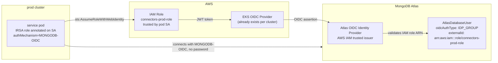
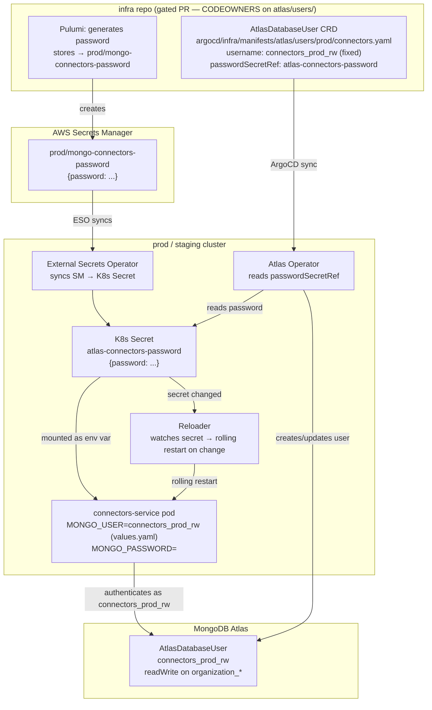
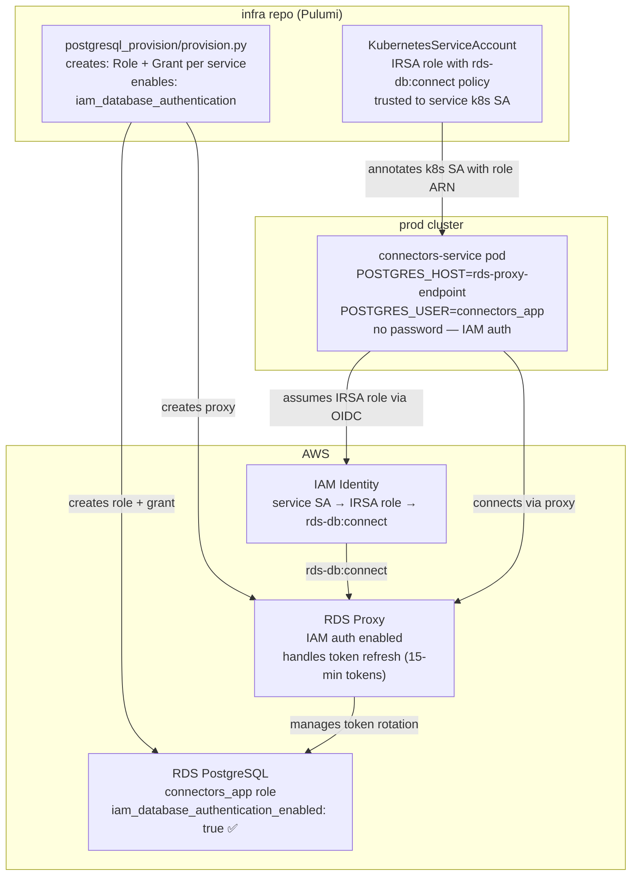
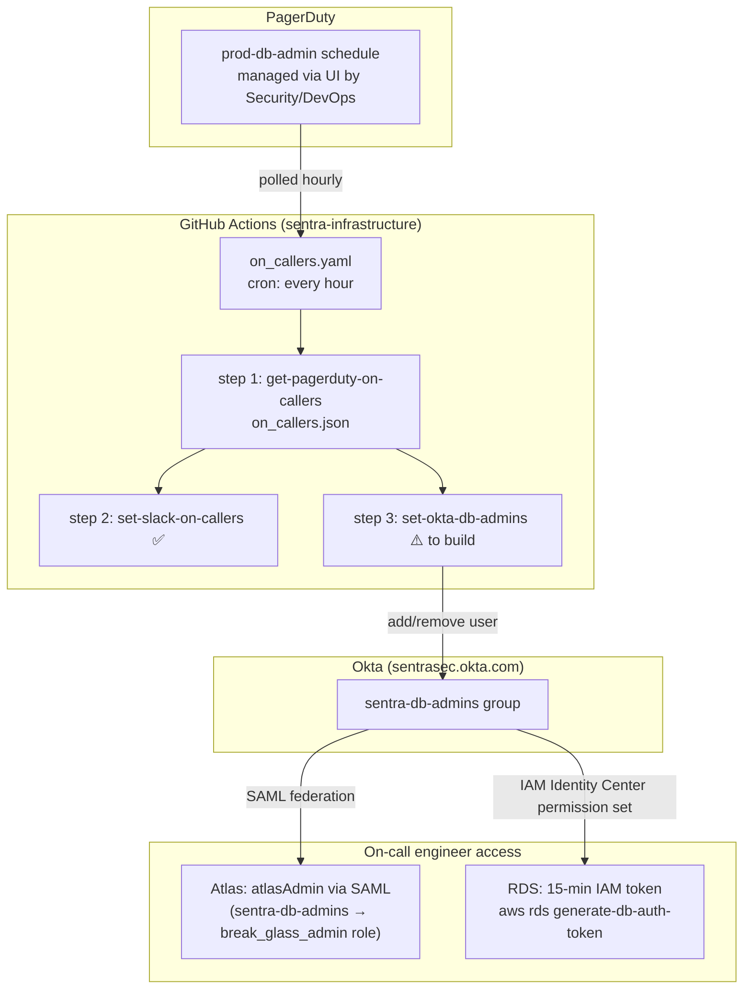
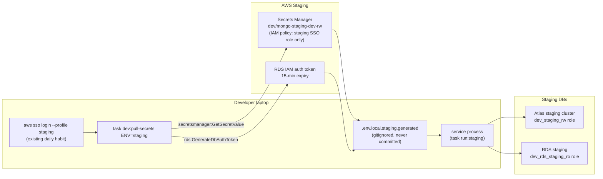
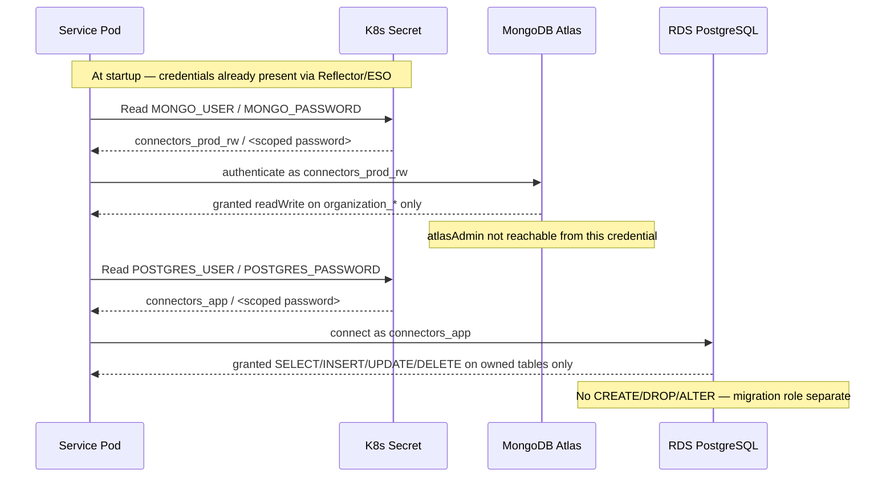
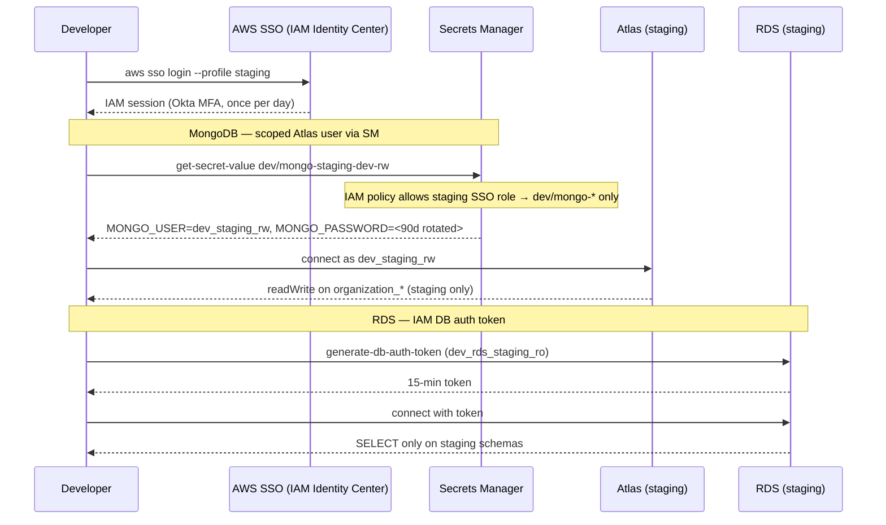
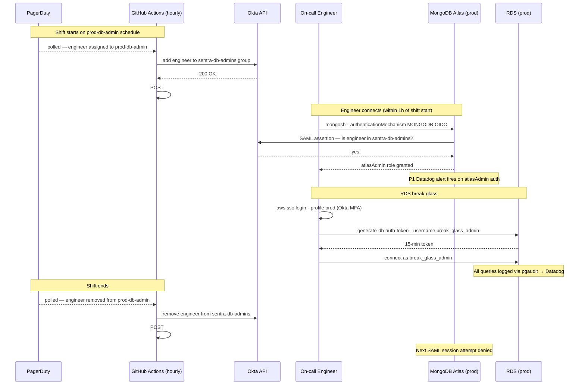
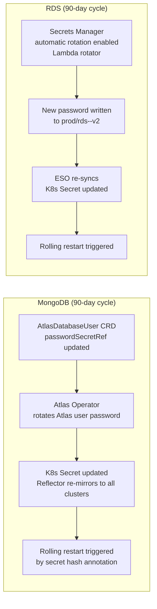

# ADR-001: Least-Privilege Access for MongoDB Atlas & RDS

**Status:** Accepted  
**Date:** 2026-05-17  
**Story:** [#70385](https://app.shortcut.com/sentra/story/70385)  
**Epic:** [#70383](https://app.shortcut.com/sentra/epic/70383)  
**RFC:** [rfc-least-privilege-db-access.md](./rfc-least-privilege-db-access.md)

---

## Stakeholders

| Stakeholder | Role | Viewpoint |
|---|---|---|
| Platform Engineering / DevOps lead | **Decision owner** — designs and implements | Architecture, Operations |
| Security team | **Approver** — threat model, break-glass governance | Security, Compliance |
| Engineering Manager (R&D) | **Consulted** — developer workflow, on-call rotation eligibility | Developer Experience |
| Service owners (Application, Access, Dagster) | **Consulted** — migration validation, no-regression sign-off | Operations |
| Data Engineering lead | **Consulted** — Dagster / data pipelines (highest rollback risk) | Operations |
| Compliance / SOC2 owner | **Consulted** — audit evidence, CC6.x controls | Compliance |
| On-call engineers | **Informed** — break-glass flow changes incident response | Developer Experience |

---

## Context

Every Sentra service and human in production currently shares one of two credentials:

- **MongoDB Atlas:** single `admin` user with `atlasAdmin` role, shared by all services and all engineers
- **RDS / PostgreSQL:** master RDS credentials distributed verbatim to every service secret (~25 services)

A single compromised service pod has full admin access to all customer data across all organisations. There is no per-service audit trail, no automated rotation, and no revocation path shorter than a full credential rotation coordinated across all teams simultaneously.

---

## Decision Drivers

| Driver | Weight |
|---|---|
| Blast radius reduction — compromised pod must not reach all customer data | Critical |
| Audit trail — each DB operation must be attributable to a specific service or person | Critical |
| Automated revocation — offboarding or service removal must take effect in < 5 min | High |
| Zero-downtime migration — no service interruption during cutover | High |
| Developer experience — local dev and incident response workflows must not degrade | High |
| SOC2 CC6.1/CC6.2/CC6.3 — access control evidence for auditors | High |
| IaC consistency — credentials managed as code, not manual console operations | Medium |

---

## Options Considered

### Option 1 — Per-service scoped credentials via Atlas Operator + Pulumi (chosen)

Create dedicated database roles per service with minimum required privileges. Deliver credentials via Atlas Kubernetes Operator (MongoDB) and Pulumi + ESO (RDS). Human access via AWS SSO IAM tokens (RDS) and Okta-gated Secrets Manager (MongoDB).

### Option 2 — Shared credentials with IP restriction only

Keep shared credentials but restrict access to known Twingate IPs. Simpler, no migration risk.

**Rejected:** Doesn't address blast radius — a compromised pod inside the network still has full admin access. Fails SOC2 CC6.2 (least privilege).

### Option 3 — External secrets vault (HashiCorp Vault or AWS Secrets Manager dynamic secrets)

Replace all static credentials with dynamic secrets generated on connection.

**Rejected for v1:** Requires Vault operator installation and agent injection across all services. High operational complexity for teams unfamiliar with Vault. ESO + Pulumi-managed Secrets Manager achieves 80% of the benefit with existing tooling. Can be adopted as v2 on top of this foundation.

### Option 4 — Full SSO federation for all DB access (Okta → Atlas SAML + RDS IAM)

No stored credentials anywhere — all access via SAML federation to Atlas and IAM DB auth tokens for RDS.

**Partially adopted:** RDS IAM auth is confirmed available and will be used for human access. Atlas Identity Federation (Compass SSO) is technically possible but not yet configured — deferred to a follow-up story. Service-to-service connections still use scoped passwords (Atlas OIDC workload identity for services is not yet supported at the required scale).

### Option 5 — MongoDB Workload Identity Federation via OIDC/IRSA (deferred to v2)

Eliminate username/password entirely for service-to-MongoDB connections. Services authenticate to Atlas using their AWS IAM identity (IRSA) — the same mechanism used for RDS in v1. No K8s Secret, no stored password, no rotation events.

**How it works:**



**What's needed vs v1:**

| | v1 (ESO + password) | v2 (OIDC) |
|---|---|---|
| K8s Secret with password | Required | Not needed |
| Atlas Operator CRD | `passwordSecretRef` | `oidcAuthType: IDP_GROUP` + IAM role ARN |
| Rotation events | Yes (90d, Reloader restart) | No — IAM token refresh is implicit |
| App code change | None | **Yes** — connection string must use `authMechanism=MONGODB-OIDC` |
| MongoDB driver version | Any | Must support OIDC (PyMongo ≥ 4.7, Node.js driver ≥ 6.3) |
| Atlas project config | Standard | Must configure AWS IAM as OIDC IdP in Atlas Org Federation |
| IRSA role | Not needed for MongoDB | Reuses same IRSA role already created for RDS |

**Why deferred:**
- Requires driver version audit and upgrade across all services (NestJS, FastAPI, Python workers)
- Requires code change in every service's MongoDB connection initialisation — not a config-only change
- Atlas OIDC IdP configuration requires Atlas org-admin coordination (same blocker as human SSO)
- v1 already achieves scoped, rotated, auditable credentials — OIDC is a security improvement, not a security requirement for v1

**Upgrade path from v1 to v2 is non-destructive:**
1. Upgrade MongoDB driver in service
2. Change connection string `authMechanism` to `MONGODB-OIDC`
3. Replace `AtlasDatabaseUser` CRD `passwordSecretRef` with `oidcAuthType` + IAM role
4. Remove ESO `ExternalSecret` for that service's MongoDB password
5. Deploy — Atlas Operator updates the user type; service authenticates via OIDC

Services can migrate one at a time. No cluster-wide cutover required.

---

## Decision

**Adopt Option 1** — per-service scoped credentials with a unified ESO-based secret delivery plane for both MongoDB and RDS. Management plane differs per database (Atlas Operator for MongoDB, Pulumi for RDS) but delivery to pods is identical: K8s Secret → env vars. Break-glass orchestrated by extending the existing PagerDuty → GHA cron workflow.

### Key architectural decisions within Option 1

| Decision | Choice | Rationale |
|---|---|---|
| MongoDB user creation | Centralized in infra/argocd repo | Security gate: DB privilege PRs reviewed separately from service code; CODEOWNERS enforced |
| MongoDB password source | ESO pulls from Secrets Manager → K8s Secret; Atlas Operator reads same secret | Single secret, two consumers — no duplication, no chicken-and-egg |
| MongoDB username | Fixed deterministic prefix `<service>_<env>_<role>` | Never rotates; service config is static; only password changes |
| Password rotation propagation | Reloader (deployed cluster-wide) watches K8s Secret → rolling restart | Already deployed to all clusters; zero new tooling |
| Per-service Helm user creation | **Rejected** | Creates circular dependency: Helm needs password to exist before install, but password provisioning requires a centralized step anyway. Privilege changes bundled into service deploys evade security review. |
| MongoDB service auth | Username + password (K8s Secret) | Atlas has no OIDC/IRSA equivalent for service connections. Asymmetry with RDS is acceptable — password is scoped, rotated, never on laptops. |
| RDS service auth | IRSA + RDS Proxy | Proxy handles 15-min token refresh transparently; no app code changes; no stored password |

---

## Deployment Patterns

### Pattern A — MongoDB Atlas credential delivery (approved)



**Rotation flow (90-day cycle):**
```
SM rotates password
  └─▶ ESO syncs new value → K8s Secret updated
        ├─▶ Atlas Operator reconciles → updates Atlas user password
        └─▶ Reloader detects secret change → rolling restart
              └─▶ pod starts with new password ✅ zero manual steps
```

### Pattern B — RDS credential delivery (approved)

Services connect via **IRSA + RDS Proxy**. No stored password in the pod — the proxy handles IAM token refresh transparently.



**Key properties:**
- `iam_database_authentication_enabled: true` already set on all prod RDS instances ✅
- `KubernetesServiceAccount` component (`eks_provision/service_account.py`) already builds IRSA roles ✅
- RDS Proxy removes token refresh complexity from application code
- No password in any K8s Secret, Secrets Manager, or env var for service connections

### Pattern C — Break-glass access delivery (PagerDuty → Okta → Atlas/RDS)



### Pattern D — Local developer access



---

## Security Access Flows

### Flow 1 — Service-to-database (runtime)



### Flow 2 — Human read-only access (engineer debugging staging)



### Flow 3 — Break-glass access (on-call engineer, prod incident)



### Flow 4 — Credential rotation (automated)



---

## Viewpoint Analysis

### Security viewpoint

| Concern | Before | After |
|---|---|---|
| Compromised pod blast radius | Full admin on all customer data | Read/write on owned schema only |
| Credential on developer laptop | `admin` password, never expires | 90-day rotated secret fetched on demand; 15-min RDS token |
| Stolen laptop | Permanent prod admin access | SSO session invalid — credentials useless |
| Engineer offboarded | Manual rotation of shared secret | Okta group removal → all access revoked immediately |
| Audit trail | None | Per-service Atlas audit + pgaudit + CloudTrail → Datadog |
| Break-glass accountability | Implicit (anyone with the secret) | Explicit: PD schedule → Okta group → P1 alert on use |

**Threat model gaps addressed:**
- Lateral movement from compromised pod: ✅ contained to owned schema
- Credential stuffing from leaked `.env` file: ✅ no password on laptop in target state
- Insider threat: ✅ per-operation audit trail; break-glass requires schedule membership

### Developer experience viewpoint

| Scenario | Before | After |
|---|---|---|
| Local dev (most common) | `docker compose up` + `.env.local` | Identical — no change |
| Connect to staging DB | Edit `.env.local.staging` with hardcoded admin | `aws sso login` (already done) + `task dev:pull-secrets` |
| Debug prod (read-only) | `.env.local.prod` with prod admin 🚨 | `aws sso login --profile prod` + read-only Secrets Manager fetch |
| Break-glass (on-call) | Use the same shared admin credential | SSO + automatically granted via PD schedule (≤1h lag) |

**Friction delta:** One new command (`task dev:pull-secrets`) replaces manually copying credentials from Notion/1Password. Net improvement.

### Operations viewpoint

| Concern | Mitigation |
|---|---|
| Migration downtime | Parallel-role approach — new role created alongside old; service updated to new secret; old secret kept 2 weeks for rollback |
| Permission error storm | Staging validation for 48h before prod cutover per service |
| Rotation causing downtime | Atlas Operator + ESO update secrets in-place; rolling restart on hash change |
| Runbook for break-glass | Story #70395 — quarterly access review runbook covers emergency procedures |
| Phase 6 (Temporal/Dagster) risk | Last in rollout order; stateful workloads require schema ownership review before migration |

### Compliance viewpoint (SOC2 CC6.x)

| Control | Requirement | How addressed |
|---|---|---|
| CC6.1 | Logical access uses unique IDs | Per-service DB roles; no shared credentials |
| CC6.2 | Access provisioned based on job function | Atlas roles via CRD (PR-reviewed IaC); RDS roles via Pulumi |
| CC6.3 | Access removed promptly | Okta group removal = immediate revocation; ESO sync = <1h |
| CC6.6 | Restrictions on privileged access | `atlasAdmin` only via break-glass; PD schedule = security gate |
| CC7.2 | Monitor system components | Atlas audit log + pgaudit + CloudTrail → Datadog alerts |

### Architecture viewpoint

| Decision | Rationale |
|---|---|
| **ESO as unified password source for MongoDB** | ESO writes K8s Secret from SM; Atlas Operator reads same secret as `passwordSecretRef`; service reads same secret. Single secret, two consumers, no duplication. |
| **Fixed username prefix, rotating password only** | `connectors_prod_rw` never changes — service config is static. Only the password value rotates. Simplifies connection string management across environments. |
| **Reloader for rotation propagation** | Already deployed cluster-wide via `clusters: {}` ApplicationSet. Watches K8s Secret changes → rolling restart. Zero new tooling, zero manual steps on 90-day rotation. |
| **Centralized AtlasDatabaseUser CRDs (not per-service Helm)** | Per-service Helm creates circular dependency (password must pre-exist before Helm install) and bundles privilege changes into service deploys, evading security review. Centralized = one approval gate, CODEOWNERS enforced. |
| **IRSA + RDS Proxy for service RDS auth** | IRSA is already built (`service_account.py`); `iam_database_authentication_enabled` already on in prod. RDS Proxy removes 15-min token refresh from application code — no app changes required. |
| **Management plane split is intentional** | Atlas Operator for MongoDB (purpose-built, CRD lifecycle, secret generation); Pulumi for RDS (SQL Role/Grant, IRSA policy). Delivery plane is identical: K8s Secret → env vars for MongoDB; IRSA → proxy → no secret for RDS. |
| **GHA cron for PagerDuty→Okta sync** | Reuses existing hourly `on_callers.yaml` workflow. No n8n, no webhooks, no new infrastructure. Third step added to existing job. |
| **MongoDB human access via SM scoped credential** | Atlas SAML federation possible but requires Atlas org-admin + Okta admin coordination — deferred. SM credential fetched via `aws sso login` (existing habit) achieves equivalent security posture unblocked. |
| **MongoDB service auth: password in v1, OIDC in v2** | v1 uses ESO + K8s Secret + Atlas Operator (no code change, ships now). v2 upgrades to OIDC/IRSA (no stored password, parity with RDS) but requires MongoDB driver upgrade + connection string change per service. Non-destructive migration: services move one at a time. |

---

## Consequences

### Positive
- Any single service credential compromise is contained to its own schema
- Offboarding an engineer revokes all DB access in < 1 hour (Okta) or immediately (AWS SSO session)
- Credential rotation is automated — no coordinated multi-team rotation event
- Full per-operation audit trail to Datadog
- SOC2 CC6.x controls met with evidence

### Negative / Trade-offs
- **Migration complexity:** ~25 service secrets need updating; 6 migration phases with 48h staging validation each — estimated 8–12 weeks elapsed time
- **Initial setup cost:** Atlas Operator move to platform-tools, CRD authoring for all users, Pulumi role provisioning for all services
- **Break-glass lag:** Access granted on next hourly GHA cron run (≤60 min). Acceptable for planned on-call; for immediate incidents, `task db:break-glass` manual override needed as fallback
- **Atlas Identity Federation deferred:** Compass SSO login not available in v1 — developers use SM-fetched credentials instead

### Risks

| Risk | Likelihood | Impact | Mitigation |
|---|---|---|---|
| Service deploys with new role before Pulumi grants are applied | Medium | High | Deployment pipeline checks for secret existence before rollout |
| `prod-db-admin` PD schedule misconfigured (wrong people) | Low | Critical | Security team owns schedule; quarterly audit |
| Okta `groups:manage` scope unavailable | Medium | Medium | Fallback: IAM Identity Center permission sets + dedicated Atlas user (no Okta group API needed) |
| Temporal/Dagster migration breaks stateful workloads | Low | High | Phase 6 last; schema ownership review in Story #70387 before migration |

---

## Implementation Stories

| Story | Title | Phase |
|---|---|---|
| #70385 | Design RFC (this ADR) | Pre-work |
| #70386 | MongoDB access discovery | Pre-work |
| #70387 | RDS access discovery + migration framework inventory | Pre-work |
| #70388 | Atlas Operator: move to platform-tools, create AtlasProject CRDs | Phase 1 |
| #70389 | MongoDB: create per-service AtlasDatabaseUser CRDs | Phase 1 |
| #70390 | RDS: create per-service Pulumi roles + enable staging IAM auth | Phase 1 |
| #70391 | Service migration Phase 1–2 (low blast radius services) | Phase 2 |
| #70392 | Service migration Phase 3–4 (core services + Debezium) | Phase 3 |
| #70393 | Human access: Okta groups, SM scoped secrets, dev workflow tasks | Phase 2 |
| #70394 | Break-glass: `okta_assign_db_admins.py` + GHA step + PD schedule | Phase 2 |
| #70395 | Quarterly access review runbook | Phase 3 |

---

## References

| Resource | Location |
|---|---|
| RFC | `sentra/docs/rfc-least-privilege-db-access.md` |
| Atlas Pulumi provisioning | `sentra-infrastructure/mongodb_provision/mongodb.py` |
| RDS Pulumi provisioning | `sentra-infrastructure/postgresql_provision/provision.py` |
| On-callers GHA workflow | `sentra-infrastructure/.github/workflows/on_callers.yaml` |
| PagerDuty on-callers script | `sentra-infrastructure/scripts/pager_duty_get_on_callers.py` |
| Slack on-callers script (template for Okta) | `sentra-infrastructure/scripts/slack_assign_on_call_groups.py` |
| Okta user sync script | `sentra-infrastructure/scripts/okta_user_sync.py` |
| Atlas Operator ArgoCD ApplicationSet | `sentra/argocd/infra/mongodb-operator_applicationset.yaml` |
| Prod RDS stack config | `sentra-infrastructure/Pulumi.prod.yaml` |
